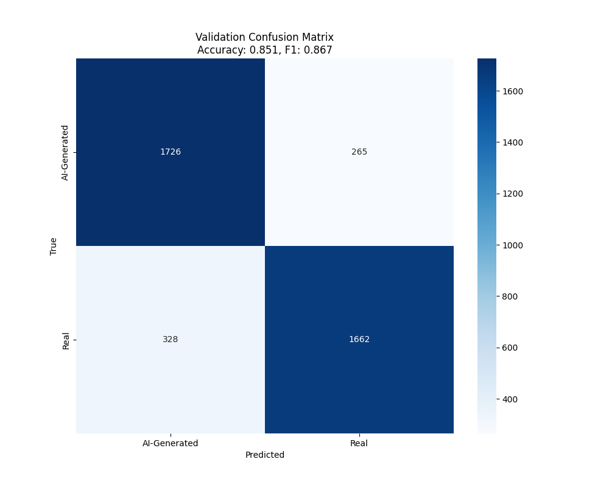
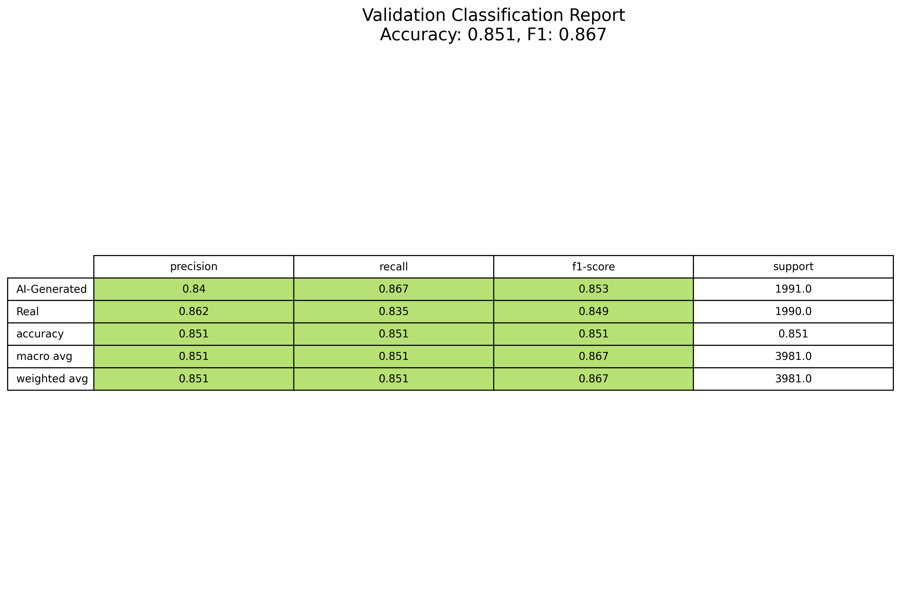

# AI-Generated Video Detection

A deep learning model for detecting AI-generated videos with 85.12% accuracy, trained and validated on a large-scale dataset.

## Overview

This project implements a neural network architecture for distinguishing between real and AI-generated videos. The model processes videos through multiple stages of feature extraction and classification, utilizing both spatial and temporal information.

## Performance Metrics

### Validation Results
- **Accuracy**: 85.12%
- **F1 Score**: 86.72%
- **Validation Dataset Size**: 3,981 videos
- **Balanced Performance**:
  - AI-Generated Detection Rate: 85.12%
  - False Positive Rate: 14.88%
### Confusion Matrix

### Classification Report

### Model Characteristics
- Robust performance across different video types
- Balanced precision and recall metrics
- Effective handling of temporal features
- Strong generalization capabilities

## Architecture


The model consists of three main components:


1. **Latent Encoder** (`FullLatentEncoder`)
   - Processes raw video frames through 3 convolutional layers
   - Reduces spatial dimensions by a factor of 8
   - Uses GroupNorm for better training stability
   - Output channels: 32 → 64 → 128


2. **Patch Encoder** (`FullPatchEncoder`)
   - Extracts 8x8 patches from latent representations
   - Processes patches through convolutional layers
   - Maps features to 768-dimensional embeddings
   - Implements efficient patch processing pipeline


3. **Classifier** (`FullClassifier`)
   - Transformer-based architecture with 12 layers
   - 12-head self-attention mechanism
   - Robust temporal relationship modeling
   - Efficient gradient checkpointing for memory optimization

## Feature Analysis

The model includes comprehensive feature extraction and analysis tools:
- Raw patch visualization (8x8 segments)
- Channel-wise feature map analysis
- Temporal relationship visualization
- Attention pattern analysis

## Deployment

### AWS SageMaker Deployment

The project includes a Dockerfile and SageMaker training script (`sm_train.py`) configured for AWS SageMaker training and deployment. The implementation includes advanced features such as mixed precision training, gradient accumulation, and automated logging.

```bash
# Build the Docker image locally
docker build -t aigen-detector .

# Test locally
docker run -v $(pwd)/data:/opt/ml/input/data/training aigen-detector
```

#### SageMaker Training Configuration

1. **Training Script Features** (`sm_train.py`):
- Automated hyperparameter optimization
- Mixed precision training with gradient scaling
- Gradient accumulation for effective batch size control
- TensorBoard integration with S3 synchronization
- Automated model checkpointing
- GPU memory optimization
- Comprehensive logging and metrics tracking

2. **Push Docker Image to ECR**:
```bash
# Create ECR repository
aws ecr create-repository --repository-name aigen-detector

# Login to ECR
aws ecr get-login-password --region your-region | docker login --username [Your AWS Account ID] --password-stdin [Your AWS Account ID].dkr.ecr.your-region.amazonaws.com

# Tag and push image
docker tag aigen-detector:latest [Your AWS Account ID].dkr.ecr.[Your Region].amazonaws.com/aigen-detector:latest
docker push [Your AWS Account ID].dkr.ecr.[Your Region].amazonaws.com/aigen-detector:latest
```

3. **Training Job Parameters**:
```python
import sagemaker
from sagemaker.estimator import Estimator

estimator = Estimator(
    image_uri='your-account.dkr.ecr.your-region.amazonaws.com/aigen-detector:latest',
    role='your-sagemaker-role-arn',
    instance_count=1,
    instance_type='ml.p3.2xlarge',
    hyperparameters={
        'epochs': 10,
        'batch-size': 6,
        'learning-rate': 0.0001,
        'warmup-epochs': 2,
        'gradient-accumulation-steps': 2,
        'target-size': 512,
        'max-frames': 24
    },
    volume_size=100,
    max_run=86400,
    input_mode='File',
    output_path='s3://your-bucket/output'
)
```

4. **Environment Configuration**:
The training environment is configured with:
- PyTorch 2.1.0 with CUDA 12.1
- NVIDIA CUDNN 8
- Mixed precision support
- S3 integration for data and model storage
- TensorBoard logging with S3 sync
- Automated checkpoint management


## Usage

### Training

```bash
python full_train.py
```

The training script includes:
- Mixed precision training
- Gradient accumulation
- TensorBoard logging
- Automated checkpoint management
- Memory optimization techniques

### Feature Extraction

```bash
python feature_extractor.py
```

Provides detailed feature analysis including:
- Raw patch extraction
- Layer-wise feature visualization
- Channel importance analysis
- Temporal pattern visualization

### Model Interpretation

```bash
python interpret.py
```


Offers comprehensive interpretation tools:

- Integrated Gradients visualization
- Frame-by-frame attribution
- Feature importance heatmaps
- Temporal attention patterns
- activations can be viewed in file attributions_4.mp4

## Hardware Requirements

- **Inference/Feature Analysis**: 6GB GPU VRAM minimum
- **Training**: 24GB GPU VRAM recommended/96GB recommended for AWS SageMaker

## Dependencies

Main requirements:
- PyTorch 2.1.0+
- CUDA 12.1
- OpenCV
- NumPy
- TensorBoard
- Captum
- scikit-learn

## License

This project is licensed under the MIT License - see the LICENSE file for details.

## Changelog

### 2026-03-26 — API Server & Explainability Improvements

#### Asynchronous Attribution Pipeline
- Attribution generation (Integrated Gradients) now runs in a background thread so the `/api/predict` endpoint returns immediately with the classification result
- Clients poll `/api/attributions/status/<video_id>` for completion (`processing` → `ready` | `error`)
- Attribution video is served via `/api/download/<video_id>` with HTTP Range request support for browser streaming

#### IG Baseline: Real-Frame Average (replaces zeros)
- Previous baseline was `torch.zeros_like(video_tensor)` — in normalized input space this represents the ImageNet mean colour, not black, causing colour-blindness and violating the IG completeness axiom
- New baseline is the pixel-wise average of normalized real (msrvtt) video tensors, computed once at server startup from `saved_videos/` and cached as a global tensor on the active device
- Deduplication by MD5 prevents repeated user uploads from skewing the mean
- Falls back to zeros with a warning if no real videos are found
- Research basis: Bardhan et al. (2024) — distribution-matched baselines achieve 2–3× better attribution localization than zero baselines; Distill.pub (2020)

#### Zero-Attribution Fix in Visualize
- Fixed `AssertionError: Cannot normalize by scale factor = 0` in captum's `visualize_image_attr` that silently failed attribution jobs
- When Integrated Gradients produces all-zero attributions for a frame (e.g. flat gradient regions), a `1e-10` epsilon is added before passing to captum's normalizer
- Root cause: discovered by adding `PYTHONUNBUFFERED=1` to the systemd service and propagating the real exception instead of swallowing it with a generic message

#### Error Logging Improvements
- Added `PYTHONUNBUFFERED=1` to `aigendetector.service` so Python output flushes immediately to `journalctl`
- `generate_attributions()` now re-raises exceptions after logging the full traceback to stderr, so the actual error message is stored in the attribution job tracker and returned by the status endpoint instead of the generic `"Attribution generation failed"`

#### CORS Fix for Attribution Video Streaming
- Added `expose_headers` configuration to flask-cors for the `/api/download` endpoint to support HTTP Range requests from browsers

#### Model Update — v2 Epoch 4 (ninox_1.pt)
- Pulled `checkpoint_epoch_0004.pt` from `s3://genvideo-complete/checkpoints/fullvideo_v2/`
- Validation accuracy: **92.14%** | F1: **0.9242** | AUC: **0.9719**
- Checkpoint verified: 186/186 state dict keys matched, clean load with no missing or unexpected keys
- Previous best: 85.12% accuracy

---

## Citation

If you use this work in your research, please cite:

```bibtex
@misc{aigenvideodetection2024,
  title={AI-Generated Video Detection Using Deep Learning},
  author={Joshua Weg},
  year={2024},
  publisher={GitHub},
  howpublished={\url{https://github.com/Joshuaweg/AIgendetector}}
}
``` 
